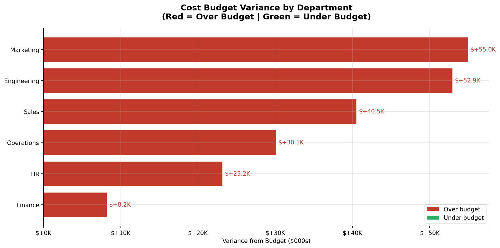

# Business Budget Analysis

## Overview
Business budget vs actual analysis across 6 departments 
over 2 years (2022–2023). Identifies overspending departments, 
loss-making units, and profit margin leaders using Python.

## Key Results
- Total Revenue (Actual): $2,953,200 — beat budget by +9.4%
- Total Costs (Actual): $1,869,872 — over budget by 12.6%
- Total Profit: $1,083,327
- All 6 departments exceeded their cost budgets
- Best margin: Sales (62.7%) | Loss-making: HR (-81.5%)
- Biggest overspend: Marketing (+$54,963)

## Visualizations

| Chart | Description |
|-------|-------------|
| Chart 1 | Revenue actual vs budget by department |
| Chart 2 | Monthly revenue trend by department |
| Chart 3 | Cost breakdown by category |
| Chart 4 | Profit margin by department |
| Chart 5 | Budget variance — diverging bar |
| Chart 6 | Monthly actual vs budget with shading |
| Chart 7 | Department performance scorecard heatmap |

## Key Insights
- Every department overspent — but company still beat revenue target by $253K
- HR is operating at -81.5% margin — urgent restructuring needed
- Sales drives 62.7% profit margin — must be protected from budget cuts
- Salaries represent 50–65% of costs across all departments

## Tools Used
Python | pandas | numpy | matplotlib | seaborn | Jupyter Notebook

## Files
- `business_budget_analysis.ipynb` — Full analysis notebook
- `README_Project.docx` — Detailed project write-up
